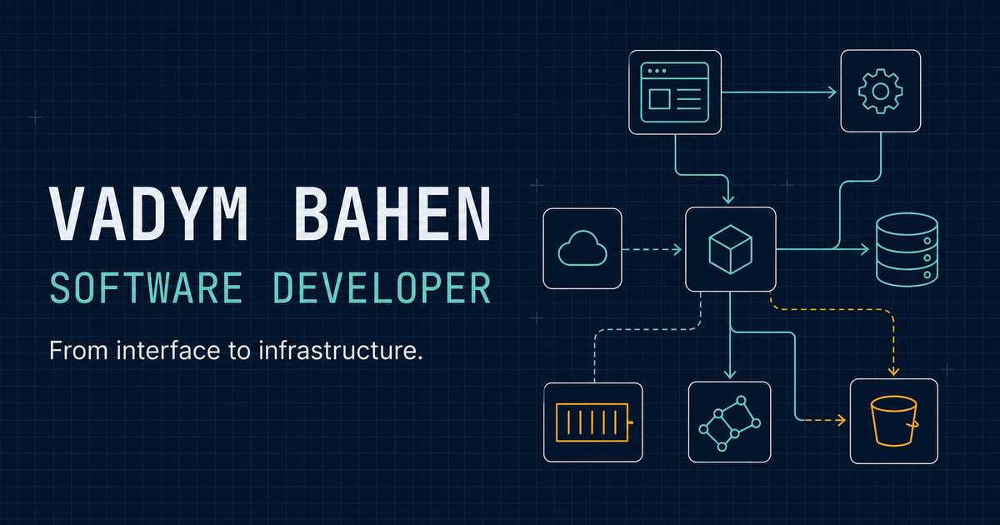

# Vadym Bahen — Portfolio

Personal software developer portfolio showcasing selected projects, technical
skills, and case studies.

[View the live portfolio](https://vadymbahen.pages.dev/)

## Built with

- Semantic HTML
- Modern CSS with responsive dark and light themes
- Vanilla JavaScript

## Run locally

Open `index.html` in a browser or serve the folder with any static file server.

## Structure

- `index.html` — page content and metadata
- `styles/style.css` — responsive design and themes
- `script.js` — navigation, theme switching, filters, and interactions
- `assets/` — favicon and social sharing image
- `output/pdf/` — downloadable CV
